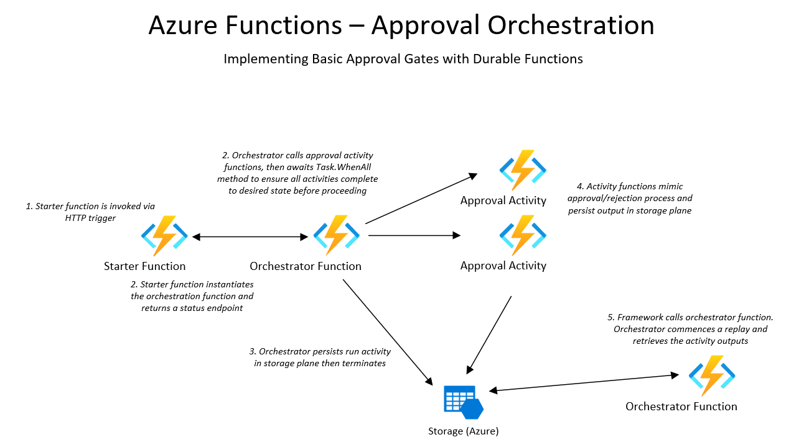

<properties
    pageTitle="Azure Functions Approval Orchestration"
    description="Demo of Azure Durable Functions framework"
    services="azure-functions,durable-functions,c-sharp"
    documentationCenter="Azure"
/>

<tags
    ms.service="azure-functions"
    ms.devlang="C#"/>

## Overview

This project implements a basic approval gate pattern using the Azure Durable Functions Framework. It is a variation of one of the Azure Quickstart walkthrougs available [here](https://docs.microsoft.com/en-us/azure/azure-functions/durable/durable-functions-external-events?tabs=csharp)

#### Azure Functions:
- Version: 2.0
- Runtime: DotNet Core 2.1

#### Extensions:
- Microsoft.Azure.WebJobs.Extensions.Http
- Microsoft.Azure.WebJobs.Extensions.DurableTask
- Microsoft.NET.Sdk.Functions

#### Starter Function
Input Bindings: HTTP  
Output Bindings: IDurableOrchestrationClient

#### Orchestrator Function
Input Bindings: IDurableOrchestrationContext

#### Activity Function
Input Bindings: ActivityTrigger

### Overview

The application utilizes a starter function with an HTTP trigger that accepts either a GET or POST action. The starter function then asyncronously instantiates the orchestrator function, logs the startup activity and returns a CheckStatusResponse endpoint. This return manifests in the browser as different endpoints that can be queried afterwards where the Azure Functions Durable Framework will return status and information about this durable function instance:

You can use the shown **StatusQueryGetURI** to return the overall status and results from the activity function runs:

When the orchestrator function starts, it creates two activity functions asyncronously via the CallActivityAsync method of the DurableOrchestrationContext object, which is passed in to the orchestrator function via the OrchestrationTrigger input binding. These activities will simulate the two different approval actions of approved or rejected. Each activity function returns an approval status which is assigned to a local variable. The orchestrator function then Awaits the WhenAll method of the fuction's Task object. This will pause the orchestrator function's execution until both of the approval activities make their returns. It then creates a System.Collections.Generic.List object of type System.String which will be used to contain the outputs from the activity functions. These approval results are then returned from the call and the orchestrator terminates. 

The ActivityTrigger input binding of the activity function flags its function type to the Durable Functions Framework. The framework keeps track of all activity instances for a particular orchestrator in order to signal back when all activities have either completed or timed out. These activity functions simply log the string passed to them and use that string in the returned message. 
