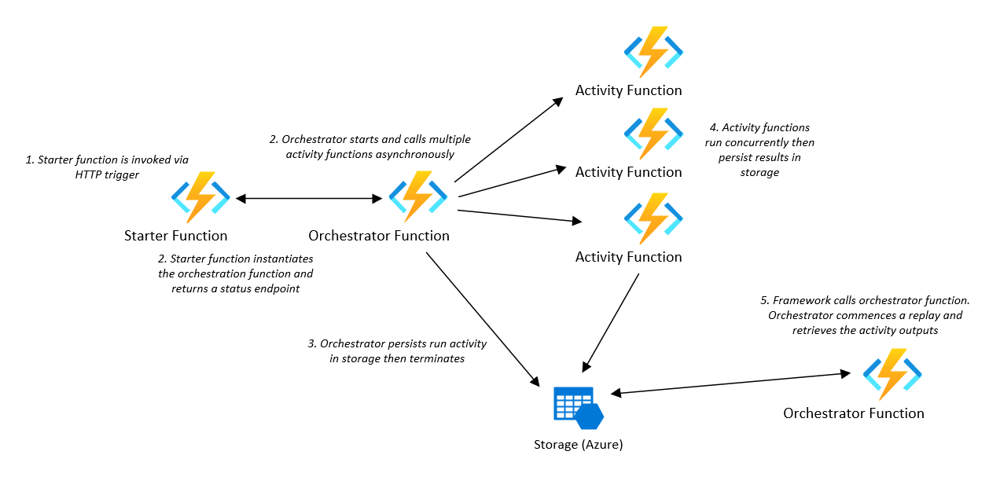

# Azure Functions Demos - Hello Orchestration

## Overview

This project demonstrates implementing a fan-out/fan-in application pattern using the Azure Durable Functions Framework. It is a variation of one of the Azure Quickstart walkthrougs available [here](https://docs.microsoft.com/en-us/azure/azure-functions/durable/durable-functions-create-first-csharp?pivots=code-editor-vscode)

<properties
    pageTitle="Azure Functions Hello Orchestration"
    description="Demo of Azure Durable Functions framework"
    services="azure-functions,durable-functions,c-sharp"
    documentationCenter="Azure"
/>

<tags
    ms.service="azure-functions"
    ms.devlang="C#"/>

#### Azure Functions:
- Version: 2.0
- Runtime: DotNet Core 2.1

#### Extensions:
- Microsoft.Azure.WebJobs.Extensions.Http
- Microsoft.Azure.WebJobs.Extensions.DurableTask
- Microsoft.NET.Sdk.Functions

#### Starter Function
Input Bindings: HTTP  
Output Bindings: IDurableOrchestrationClient

#### Orchestrator Function
Input Bindings: IDurableOrchestrationContext

#### Activity Function
Input Bindings: ActivityTrigger

### Overview

The application utilizes a starter function with an HTTP trigger that accepts either a GET or POST action. The starter function then asyncronously instantiates the orchestrator function, logs the startup activity and returns a CheckStatusResponse endpoint. This return manifests in the browser as different endpoints that can be queried afterwards where the Azure Functions Durable Framework will return status and information about this durable function instance.
