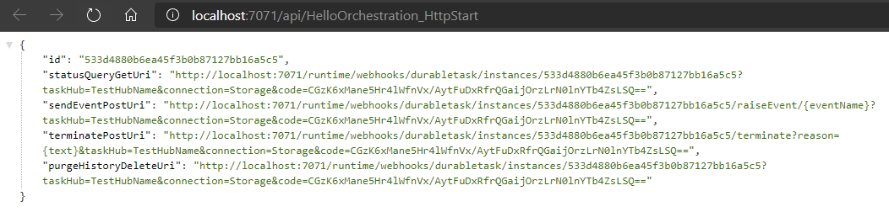
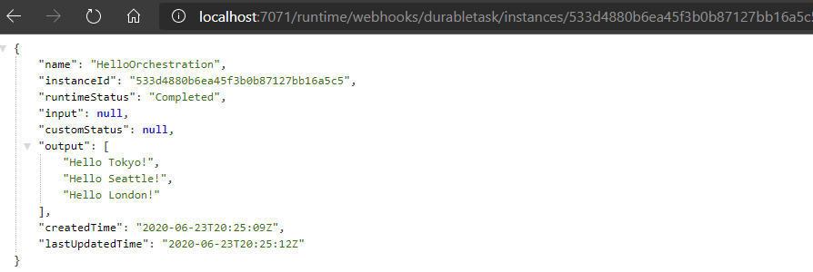

# Azure Functions Demos - Hello Orchestration

## Overview

This project demonstrates implementing a fan-out/fan-in application pattern using the Azure Durable Functions Framework. It is a variation of one of the Azure Quickstart walkthrougs available [here](https://docs.microsoft.com/en-us/azure/azure-functions/durable/durable-functions-create-first-csharp?pivots=code-editor-vscode)

<properties
    pageTitle="Azure Functions Hello Orchestration"
    description="Demo of Azure Durable Functions framework"
    services="azure-functions,durable-functions,c-sharp"
    documentationCenter="Azure"
/>

<tags
    ms.service="azure-functions"
    ms.devlang="C#"/>

#### Azure Functions:
- Version: 2.0
- Runtime: DotNet Core 2.1

#### Extensions:
- Microsoft.Azure.WebJobs.Extensions.Http
- Microsoft.Azure.WebJobs.Extensions.DurableTask
- Microsoft.NET.Sdk.Functions

#### Starter Function
Input Bindings: HTTP  
Output Bindings: IDurableOrchestrationClient

#### Orchestrator Function
Input Bindings: IDurableOrchestrationContext

#### Activity Function
Input Bindings: ActivityTrigger

### Overview

The application utilizes a starter function with an HTTP trigger that accepts either a GET or POST action. The starter function then asyncronously instantiates the orchestrator function, logs the startup activity and returns a CheckStatusResponse endpoint. This return manifests in the browser as different endpoints that can be queried afterwards where the Azure Functions Durable Framework will return status and information about this durable function instance:

You can use the shown **StatusQueryGetURI** to return the overall status and results from the activity function runs:

When the orchestrator function starts, it creates a System.Collections.Generic.List object of type System.String which will be used to contain the outputs from the activity functions. It then creates three activity functions asyncronously via the CallActivityAsync method of the DurableOrchestrationContext object which is passed in to the orchestrator function via the OrchestrationTrigger input binding. The instantiation of the activity functions is performed within the Add method of the List object, so that the activity function's output will be automatically added to the list when each function completes. 

Since the activity functions are called asyncronously this signals to the Durable Functions Framework that execuation of the orchestrator function whould be terminated at this point in order to allow the activity functions to complete. The orchestrator will be invoked again after all activity functions complete. 

The ActivityTrigger input binding of the activity function flags its function type to the Durable Functions Framework. The framework will then keep track of all of the activity instances for a particular orchestrator in order to signal back that all activities have either completed or timed out. These activity functions simply log the string passed to them and use that string in the returned message. 

When all of the activity functions have completed, the framework will call the orchestrator function again. The orchestrator function begins a replay, which means it will execute all of its code from the beginning. This is an important concept, since you will need to code your orchestrator function logic to allow for proper execution during replays. 
