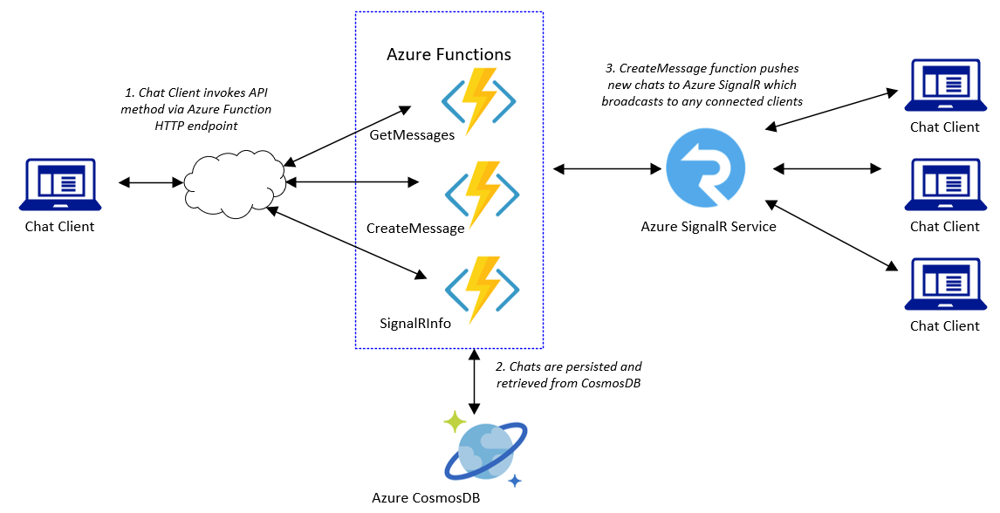

# Azure Functions Demos - SignalR Chat/JS

## Overview

This project demonstrates creating a serverless chat application utilizing JavaScript based Azure Functions along with the Azure SignalR service. It is a variation of one of the Azure Quickstart walkthrougs available [here](https://docs.microsoft.com/en-us/azure/azure-signalr/signalr-quickstart-azure-functions-csharp)

<properties
    pageTitle="Azure Functions Serverless Chat Demo"
    description="Demo of a serverless chat app utilizing Azure Functions and Azure SignalR service"
    services="azure-functions,azure-signalr,javascript"
    documentationCenter="Azure"
/>

<tags
    ms.service="azure-functions"
    ms.devlang="JS"/>

Azure Functions:
- Version: 2.0
- Runtime: Node

Extensions:
- Microsoft.Azure.Functions.ExtensionBundle

Input Bindings: HTTP

Output Bindings:
- CosmosDB
- Azure SignalR

The application utilizes three separate JS based Azure Functions to provide application API's. The chat client ([index.html](./content/index.html)) is a JS SPA located in the [content](./content) folder. It utilizes the [ASP.Net Core SignalR JavaScript client](https://docs.microsoft.com/en-us/aspnet/core/signalr/javascript-client?view=aspnetcore-3.1) for connectivity to the Azure SignalR service instance, and depends upon the following setting:
- window.apiBaseUrl: Azure SignalR Service endpoint

The GetMessages and CreateMessage functions bind to the hub of the Azure SignalR service instance through their respective output and input bindings. The client will thus invoke the Azure Function CreateMessage when a new chat message is sent to the SignalR hub and automatically receive any chat messages through the Azure Function GetMessages whenever other clients do the same. The CreateMessage function also has an output binding to Azure CosmosDB which will persist the message content as well as user name that the GetMessages function will retrieve through its input binding. These two functions depend upon the following settings for connectivity:
- CosmosDBConnectionString: connection string to specified CosmosDB backend e.g. *AccountEndpoint=https://<your_cosmosdb>.documents.azure.com;AccessKey=<your_key>;*
- AzureSignalRConnectionString: connection string to specified Azure SignalR instance e.g. *Endpoint=https://<your_signalr>.signalr.net;AccessKey=<your_key>;version=1.0;*
