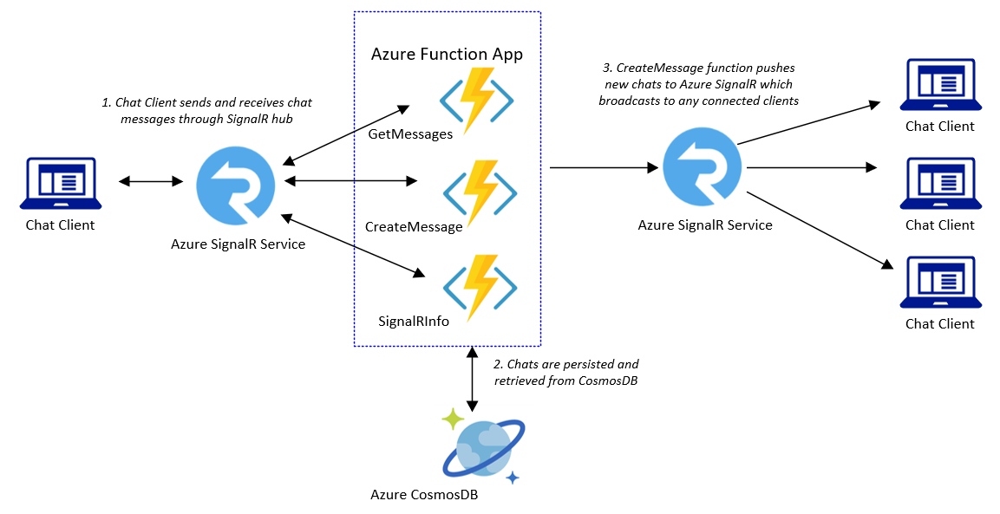

# Azure Functions Demos - SignalR Chat/JS

## Overview

This project demonstrates creating a serverless chat application utilizing JavaScript based Azure Functions along with the Azure SignalR service. It is a variation of one of the Azure Quickstart walkthrougs available [here](https://docs.microsoft.com/en-us/azure/azure-signalr/signalr-quickstart-azure-functions-csharp)

<properties
    pageTitle="Azure Functions Serverless Chat Demo"
    description="Demo of a serverless chat app utilizing Azure Functions and Azure SignalR service"
    services="azure-functions,azure-signalr,javascript"
    documentationCenter="Azure"
/>

<tags
    ms.service="azure-functions"
    ms.devlang="JS"/>

Azure Functions Version: 2.0
Extensions:
- Microsoft.Azure.Functions.ExtensionBundle
Input Bindings:
- HTTP
Output Bindings:
- CosmosDB
- Azure SignalR

The application utilizes the Azure.Identity.SecretClient class in order to access an Azure Key Vault. A local instance of this class is instantiated utilizing:
- Key Vault URI
- Azure.Identity.ClientSecretCredential token

The ClientSecretCredential token is returned from a call to the Azure.Identity.ClientSecretCredential constructor utilizing:
- Azure Tenant ID
- Service Principal App ID
- Service Principal Secret

Once the SecretClient object is instantiated its GetSecret method is invoked to return an Azure.Security.KeyVault.KeyVaultSecret object containing a blob storage connection string. This connection string is then utilized to access the blob information returned by the application.
